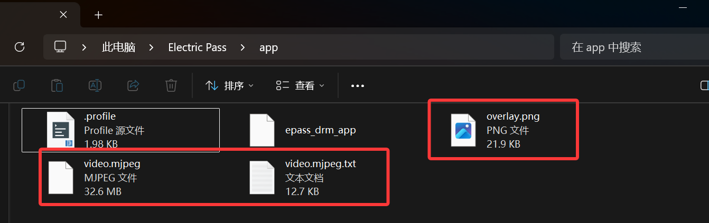
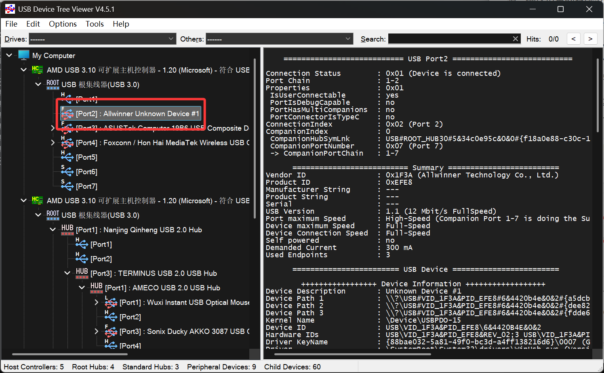
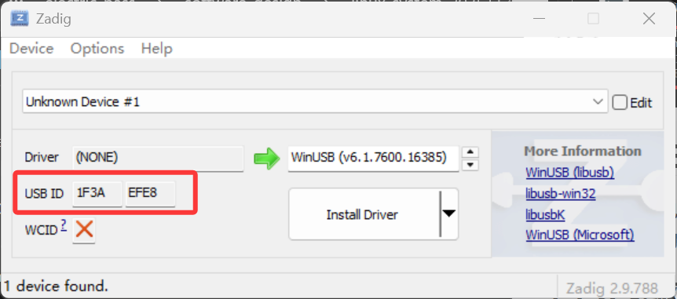
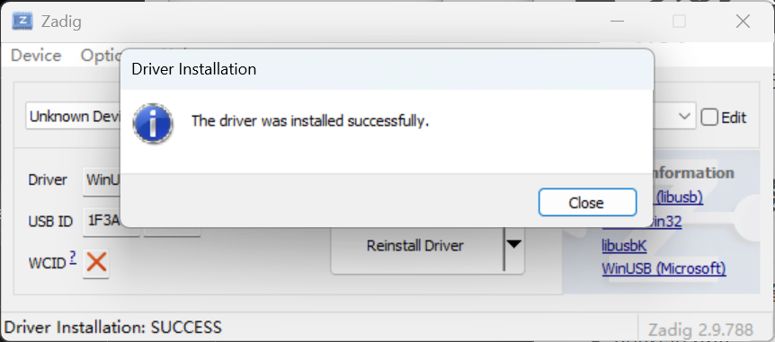
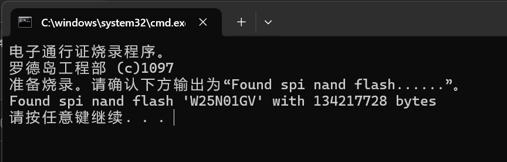
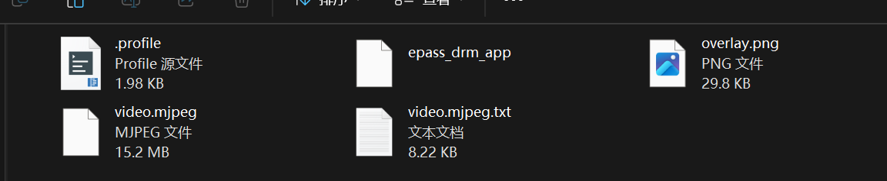

# 电子通行证 系统更新/固件烧录方法

文档版本：20251126

请先准备好固件更新包(linux_system_xxxxx)与通行证软件程序(epass_drm_app)。

将固件更新包==**全部解压缩**==出来。

## 0.备份原始数据

将通行证连接到电脑，待系统正常启动后，打开名为“Electric Pass”的设备，打开其中名为"app"的文件夹，备份其中的素材文件到电脑上：

* overlay.png
* video.mjpeg
* video.mjpeg.txt

## 1. 进入FEL下载模式

首先关闭设备电源。按住设备上丝印标注为FEL（最靠近电源拨杆）的按钮，再打开设备电源，确认设备的系统没有正常启动（没有显示PRTS LOGO）。将设备连接上电脑。

打开更新包内的usbtreeview.exe，在左边的设备树中，确定出现Allwinner Unknown Devices

## 2 安装驱动（只需要做一次）

*之前没安装过驱动才需要做这个操作*

打开升级包中的zadig-2.9.exe，确定USBID为1F3A EFE8

无误则点击Install Driver按钮。等待软件提示后The driver was installed successfully后，关闭zadig软件。

# 3 开始烧录

双击flash.bat，按提示确认输出为“Found spi nand flash...”，如图所示

如果一致的话就按下==回车键==，等待烧录进度条走完（一共六个），直到提示：“请按任意键继续...”，则烧录完成。请手动正常重启设备（不需要按FEL按钮）

# 4. 拷贝通行证软件及素材

待系统正常启动后，打开名为“Electric Pass”的设备，打开其中名为"app"的文件夹，将通行证主程序、资源文件复制到文件夹里面:

手动重启设备，确认资源正常显示。

# 常见问题

待更新
